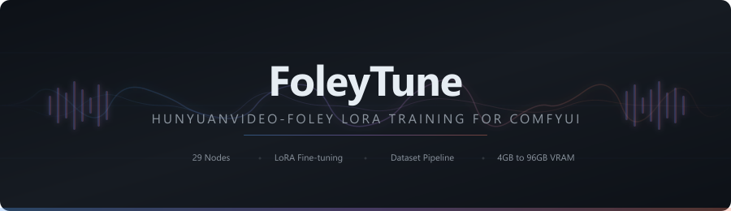
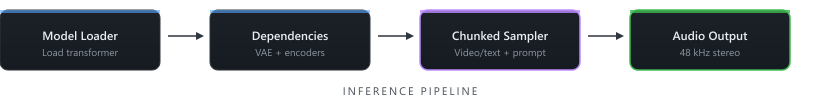
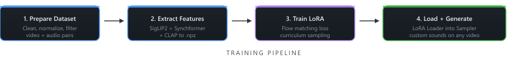

<p align="center">
  
</p>

<p align="center">
  <strong>FoleyTune — HunyuanVideo-Foley LoRA Training for ComfyUI</strong>
</p>

<p align="center">
  <a href="#quick-start-inference">Inference</a> &bull;
  <a href="#audio-manipulation">Audio Manipulation</a> &bull;
  <a href="#quick-start-training">Training</a> &bull;
  <a href="LORA_TRAINING.md">Full Training Guide</a> &bull;
  <a href="#node-reference">All 32 Nodes</a> &bull;
  <a href="#vram-guide">VRAM Guide</a>
</p>

---

## What is FoleyTune?

FoleyTune is a ComfyUI node pack for **Tencent HunyuanVideo-Foley** — a video-to-audio (and text-to-audio) diffusion model. It adds four things the original model doesn't have:

1. **LoRA training** — fine-tune the model on your own video+audio pairs to teach it sounds it doesn't know or gets wrong.
2. **Audio manipulation** — audio-to-audio generation, inpainting, feature blending, and style transfer.
3. **A dataset pipeline** — 15 nodes that clean, normalize, filter, and prepare audio before training.
4. **Flexible VRAM management** — run on anything from a 4 GB laptop GPU to a 96 GB workstation, with FP8 quantization, block swapping, and torch.compile.

---

## Installation

Clone into your ComfyUI custom nodes folder:

```bash
cd ComfyUI/custom_nodes
git clone https://github.com/ethanfel/ComfyUI-HunyuanVideo-FoleyTune.git
cd ComfyUI-HunyuanVideo-FoleyTune
pip install -r requirements.txt
```

Models are downloaded automatically on first use. To download manually, see [Model Files](#model-files).

---

## Quick Start: Inference

<p align="center">
  
</p>

1. Drop **Model Loader** -> **Dependencies Loader** -> **Chunked Sampler**.
2. For **text-to-audio**, leave the image input empty and write a prompt. For **video-to-audio**, connect an image sequence and set `frame_rate`.
3. Default settings: **Euler** scheduler, **CFG 4.5**, **50 steps**.
4. Press **Queue**.

The Chunked Sampler handles any audio length by generating in overlapping segments with crossfade. Short clips (under `chunk_duration`) run in a single pass.

### Optional nodes

| Node | What it does |
|---|---|
| **Torch Compile** | ~30% faster after the first compile |
| **BlockSwap Settings** | Offload transformer blocks to CPU for ultra-low VRAM |
| **LoRA Loader** | Load a trained adapter for custom sounds |
| **Select Audio From Batch** | Pick one clip from a batch |
| **init_audio + strength** | Connect audio to the Chunked Sampler for audio-to-audio generation (see [Audio Manipulation](#audio-manipulation)) |

---

## Audio Manipulation

FoleyTune includes nodes for editing and transforming existing audio using the model's latent space. All manipulation nodes require video features for conditioning — the model uses visual context even when working with existing audio.

### Audio-to-Audio (img2img for audio)

Connect an **AUDIO** node to the Chunked Sampler's `init_audio` input and set `strength` below 1.0. The model starts from your audio instead of pure noise, preserving its structure while regenerating details guided by the video features.

| Strength | Effect |
|---|---|
| **0.9** | Almost fully regenerated — keeps broad structure only |
| **0.5** | Balanced — preserves rhythm and energy, regenerates texture |
| **0.2** | Subtle — light resynthesis, mostly keeps original audio |
| **1.0** | Default — `init_audio` is ignored, generates from scratch |

### Inpainting

The **Inpainter** node regenerates a specific time region while keeping the rest intact. Specify `start_seconds` and `end_seconds` for the region to replace. Soft mask edges (`fade_frames`) prevent boundary artifacts.

```
Model Loader -> Dependencies Loader -> Feature Extractor
                                              |
                              init_audio -> Inpainter -> Audio Output
```

Use cases: fix a glitch in generated audio, replace one sound event, regenerate a section with a different seed.

> **Note:** Inpainting runs on the full audio duration in a single pass (not chunked). For audio longer than ~16 seconds, quality may degrade. Consider trimming first.

### Feature Blending

The **Feature Blender** mixes visual conditioning from two different videos. Connect two `FOLEYTUNE_FEATURES` outputs and set a `blend` ratio. The result is interpolated features that guide generation with characteristics of both sources.

```
Video A -> Feature Extractor A -> Feature Blender -> Chunked Sampler
Video B -> Feature Extractor B ->      |
```

Example: blend features from a close-up of a piano (Video A) with a concert hall wide shot (Video B) to get piano timbre with room ambience.

### Style Transfer

The **Style Transfer** node transfers tonal characteristics (timbre, room tone) from one audio to another using Adaptive Instance Normalization (AdaIN) in the DAC latent space. This is a direct latent operation — no denoising model is needed, only the DAC-VAE from Dependencies Loader.

| Strength | Effect |
|---|---|
| **0.0** | No change — returns content audio |
| **0.3** | Subtle tonal shift toward style audio |
| **0.7** | Strong style — timbre clearly transferred |
| **1.0** | Full AdaIN — content structure with style's tonal profile |

---

## Quick Start: Training

<p align="center">
  
</p>

### 1. Prepare your data

Collect 15-60 video+audio pairs of the sound you want to train. Diversity matters more than quantity — vary the recording environment, distance, and intensity.

**[8-cut](https://github.com/ethanfel/8-cut)** is a companion desktop tool for cutting exactly 8-second clips from source footage. It provides a visual scrubber, sound annotation, and exports labeled clips with a `dataset.json` manifest ready for the pipeline below.

Optionally clean the audio with the dataset pipeline nodes:

```
Dataset Loader -> Resampler (48kHz) -> LUFS Normalizer -> HF Smoother -> Inspector -> Saver
```

### 2. Extract features

Run **FoleyTune Feature Extractor** once per clip to cache SigLIP2, Synchformer, and CLAP features as `.npz` files.

### 3. Train

Connect **Model Loader** -> **Dependencies Loader** -> **LoRA Trainer**. Point `data_dir` at your features folder.

Recommended starting defaults:

| Parameter | Value |
|---|---|
| rank | 128 |
| timestep_mode | curriculum |
| lr | 1e-4 |
| batch_size | 8 |
| steps | 15000 |

### 4. Use the adapter

Connect **LoRA Loader** between the Model Loader and Sampler. Point it at your best checkpoint.

For the full training guide with hyperparameter recommendations, checkpoint selection, and sweep experiments, see **[LORA_TRAINING.md](LORA_TRAINING.md)**.

---

## Node Reference

### Inference (6 nodes)

| Node | Description |
|---|---|
| **FoleyTune Model Loader** | Load the transformer with precision and FP8 quantization options |
| **FoleyTune Dependencies Loader** | Load DAC-VAE, SigLIP2, Synchformer, and CLAP |
| **FoleyTune Chunked Sampler** | Generate audio from video/text with chunked overlap; optional `init_audio` + `strength` for audio-to-audio |
| **FoleyTune Torch Compile** | Optional `torch.compile` acceleration (~30% faster) |
| **FoleyTune BlockSwap Settings** | Offload transformer blocks to CPU for low-VRAM operation |
| **FoleyTune Select Audio From Batch** | Extract one audio clip from a batch by index |

### Audio Manipulation (3 nodes)

| Node | Description |
|---|---|
| **FoleyTune Inpainter** | Regenerate a time region of existing audio with soft mask edges |
| **FoleyTune Feature Blender** | Blend visual conditioning features from two videos |
| **FoleyTune Style Transfer** | Transfer tonal characteristics between audio via latent AdaIN |

### Training (7 nodes)

| Node | Description |
|---|---|
| **FoleyTune Feature Extractor** | Cache visual and text features from video+audio to `.npz` |
| **FoleyTune Batch Feature Extractor** | Process an entire dataset in one pass with I/O prefetching |
| **FoleyTune LoRA Trainer** | Train a LoRA adapter with flow matching loss and spectral eval |
| **FoleyTune LoRA Loader** | Load a trained adapter into the model with adjustable strength |
| **FoleyTune LoRA Scheduler** | Run multiple training experiments from a JSON sweep config |
| **FoleyTune LoRA Evaluator** | Compare adapters with spectral metrics and generated audio |
| **FoleyTune VAE Roundtrip** | Diagnostic: encode/decode audio through DAC to check codec quality |

### Dataset Preparation (12 nodes)

| Node | Description |
|---|---|
| **FoleyTune Dataset Loader** | Load audio files from a folder into an in-memory dataset |
| **FoleyTune Dataset Resampler** | Resample all clips to a target sample rate (soxr VHQ) |
| **FoleyTune Dataset LUFS Normalizer** | Normalize loudness to EBU R128 with true peak limiting |
| **FoleyTune Dataset Compressor** | Parallel compression to reduce dynamic range |
| **FoleyTune Dataset Inspector** | Flag quality issues: silence, clipping, loudness deviation |
| **FoleyTune Dataset Quality Filter** | Score-based filtering for silence, anomalies, frequency balance |
| **FoleyTune Video Quality Filter** | Filter video clips by analyzing their audio track quality |
| **FoleyTune Dataset HF Smoother** | Soft high-frequency attenuation across the dataset |
| **FoleyTune Dataset Augmenter** | Generate variants with pitch/time-stretch/gain changes |
| **FoleyTune Dataset Spectral Matcher** | Adaptive EQ toward a reference audio distribution |
| **FoleyTune Dataset Saver** | Save all clips to disk as FLAC with metadata |
| **FoleyTune Dataset Browser** | Browse dataset entries by index for inspection |

### Post-Processing (4 nodes)

| Node | Description |
|---|---|
| **FoleyTune Dataset Item Extractor** | Extract a single audio from a dataset by index |
| **FoleyTune HF Smoother** | Single-clip high-frequency attenuation (post-generation) |
| **FoleyTune Harmonic Exciter** | Multi-band harmonic enhancement |
| **FoleyTune Output Normalizer** | Normalize generated audio to target LUFS |

---

## Model Files

Place model files in `ComfyUI/models/foley/`. They are downloaded automatically on first use, or you can download manually.

### Optimized safetensors (recommended for inference)

From [phazei/HunyuanVideo-Foley](https://huggingface.co/phazei/HunyuanVideo-Foley):

| File | Size | Notes |
|---|---|---|
| `hunyuanvideo_foley.safetensors` | ~10.3 GB | FP16 main model |
| `hunyuanvideo_foley_fp8_e4m3fn.safetensors` | ~5.3 GB | FP8 main model |
| `hunyuanvideo_foley_fp8_e5m2.safetensors` | ~5.3 GB | FP8 (better torch.compile compat on 30-series) |
| `synchformer_state_dict_fp16.safetensors` | ~475 MB | Sync encoder |
| `vae_128d_48k_fp16.safetensors` | ~743 MB | DAC-VAE |

Set quantization to `auto` or `fp8` in the Model Loader when using FP8 files.

### Original PyTorch files (recommended for training)

From [tencent/HunyuanVideo-Foley](https://huggingface.co/tencent/HunyuanVideo-Foley):

| File | Size | Notes |
|---|---|---|
| `hunyuanvideo_foley.pth` | ~10.3 GB | Full precision transformer |
| `synchformer_state_dict.pth` | ~0.95 GB | Full precision sync encoder |
| `vae_128d_48k.pth` | ~1.49 GB | Full precision DAC-VAE |

Use the full-precision `.pth` files for training. The FP16 safetensors lose precision that matters during fine-tuning. FP8 models are inference-only.

---

## VRAM Guide

FoleyTune scales from ultra-low VRAM laptops to high-end workstations.

### Inference

| VRAM | Config | Speed |
|---|---|---|
| **4 GB** | FP8 + BlockSwap (50+ blocks) | ~60s for 5s audio |
| **8 GB** | FP8 quantization | Normal |
| **12 GB** | FP16, batch 1 | Normal |
| **24 GB** | BF16, batch 2-4 | Fast |
| **24 GB** | BF16 + Torch Compile | ~30% faster |

### Training

| VRAM | Config |
|---|---|
| **10 GB** | Gradient checkpointing + 40 blocks swapped, batch 2 |
| **12 GB** | Gradient checkpointing + 20 blocks swapped, batch 8 |
| **16 GB** | Gradient checkpointing, batch 8 |
| **24 GB** | No offload, batch 8 |
| **48+ GB** | No offload, batch 16-32 |

---

## Acknowledgements

FoleyTune builds on the work of many projects and contributors:

| Project | Role |
|---|---|
| [Tencent HunyuanVideo-Foley](https://github.com/Tencent/HunyuanVideo) | Base model, architecture, and weights |
| [ComfyUI](https://github.com/comfyanonymous/ComfyUI) | Node framework |
| [phazei](https://github.com/phazei/ComfyUI-HunyuanVideo-Foley) | Original ComfyUI node pack and optimized FP8/FP16 safetensors conversions |
| [LAION CLAP](https://github.com/LAION-AI/CLAP) | Text-audio conditioning model (`laion/larger_clap_general`) |
| [Google SigLIP2](https://huggingface.co/google/siglip2-base-patch16-512) | Visual feature extraction |
| [Synchformer](https://github.com/v-iashin/Synchformer) | Audio-visual synchronization features |
| [DAC (Descript Audio Codec)](https://github.com/descriptinc/descript-audio-codec) | Neural audio codec (VAE) |
| [8-cut](https://github.com/ethanfel/8-cut) | Companion tool for cutting 8-second training clips from source video |

## License

This project is dual-licensed:

- **Node code, training pipeline, and dataset tools** — [GPL 3.0](LICENSE)
- **Model code** (`hunyuanvideo_foley/` directory) — [Tencent Hunyuan Community License](LICENSE-TENCENT). Territory restrictions apply (excludes EU, UK, South Korea). Commercial use above 100M MAU requires a separate license from Tencent.
